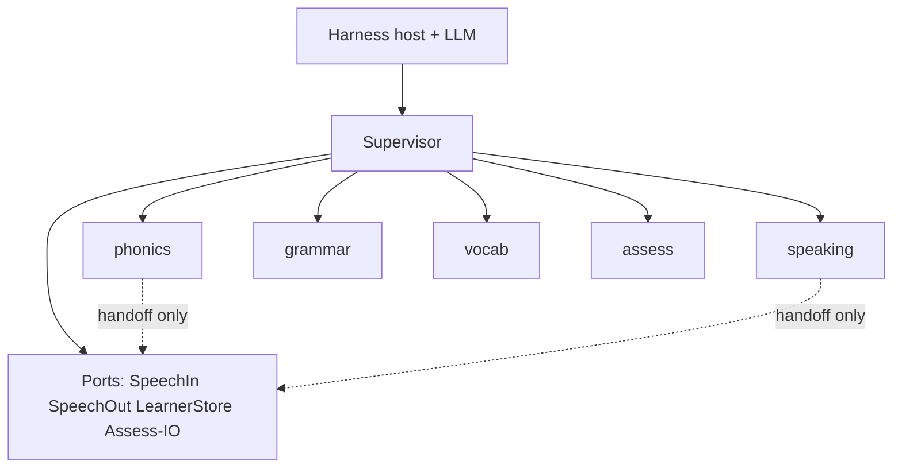
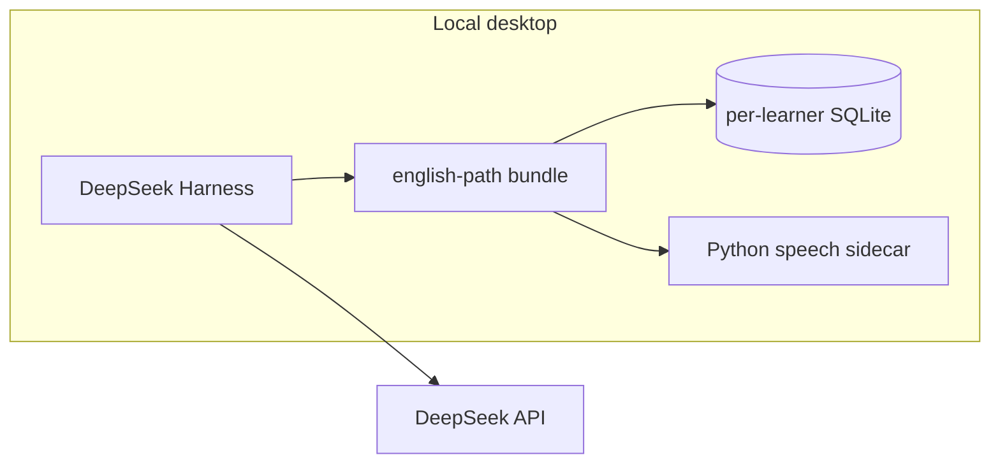
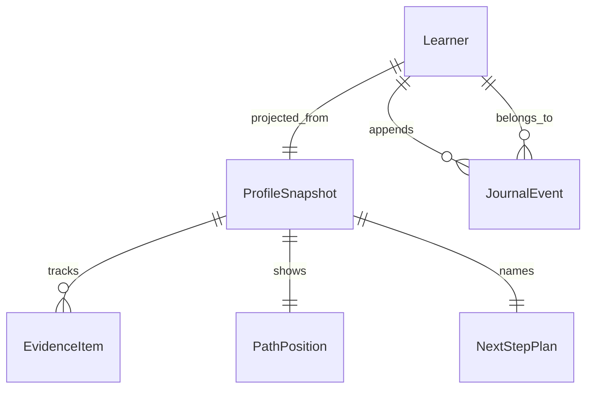

# Architecture Spine — English Path

## Design Paradigm

**Supervisor-orchestrator + specialist coaches**, with **ports at the DeepSeek Harness edge**.

| Layer        | Responsibility                                                                |
| ------------ | ----------------------------------------------------------------------------- |
| Harness host | Desktop runtime, LLM/agent loop, sparse UI shell, profile install             |
| Supervisor   | Session plan, transitions, channel grant/reclaim, journal commits             |
| Coaches      | phonics · speaking (incl. interview) · grammar · vocab(+SRS) · assess         |
| Ports        | SpeechIn · SpeechOut · LearnerStore · Assess (I/O only)                       |
| Content      | Versioned path/gates pack · generated lesson surface · iterative rubrics      |
| Persistence  | DDL/migrations for snapshot projection + journal (owned here, not by coaches) |

Writing coach is out of v1 pilot. Coaches do not negotiate the plan with each other. Learner-facing host chrome must not contradict final UX sources (`DESIGN.md`, `EXPERIENCE.md`).

## Invariants & Rules

### AD-1 — Supervisor owns plan, transitions, and evidence [ADOPTED]

- **Binds:** all session flow; FR-8, FR-12, FR-14…FR-17, FR-29
- **Prevents:** peer coaches negotiating next-step; dual writers of learner evidence
- **Rule:** Supervisor alone names the plan, drives session phase transitions, and commits durable learner mutations. Coaches return structured results only — they never write `LearnerStore` directly. Learner-facing `available` / `recommended` on the Plan are **structured content-pack lesson refs** (ids + display labels derived from the pack); supervisor **selects** among pack-legal options and utters them — it does not invent a parallel free-text availability model.

### AD-2 — One installable `english-path` bundle [ADOPTED]

- **Binds:** install shape; plugin inventory; v1 packaging
- **Prevents:** version-skew multi-plugin coach sets; silent monolith without internal ports
- **Rule:** Ship one installable `english-path` Harness profile/plugin bundle. Internal hard modules (supervisor / coaches / ports / persistence) stay distinct; defer a true multi-plugin split until Harness stability or a second product requires it.

### AD-3 — Hybrid learner channel with explicit handoff lifecycle [ADOPTED]

- **Binds:** UJ-1…UJ-5 dialogue ownership; FR-11 Self-check; FR-33 silence
- **Prevents:** dual mouths; genre blocks as supervisor monologue; coaches holding the channel after reclaim; Self-check turning into graded praise
- **Rule:** Supervisor is the sole mouth for plan naming, orientation, review weave, finale, and level-advance overlay. For **genre scenario blocks** (UJ-4 interviewer/debriefer; UJ-5 phonics micro-turns including Self-check playback), supervisor **grants** channel to one active coach and **reclaims** on block end, stop-anytime, fatigue deferral, or supervisor timeout — reclaim always wins; no dual mouths. During handoff, FR-33 Self-check silence/no-aloud-wrong still bind the active coach. On handback: structured result only. Evidence commits remain supervisor-only. On stop/fatigue reclaim: commit **earned** attempt deltas already completed in the block; **drop** pending proposals with no completed attempt; never write `unstable` solely because the session ended early.

### AD-4 — Journal is the write path; snapshot is a projection [ADOPTED]

- **Binds:** FR-29, FR-30, UJ-2 return, finale fact comparisons, PathPosition / NextStepPlan / EvidenceItem
- **Prevents:** dual writers; patching snapshot without audit; ephemeral-only progress
- **Rule:** All durable mutations append a typed `JournalEvent`, then supervisor (or its projector) rebuilds the **profile snapshot** — snapshot fields are not patched independently. Closed event types (v1): `session_start` · `prefs_set` · `phase` · `handoff_grant` · `handoff_reclaim` · `attempt` · `evidence_propose` · `plan_set` · `finale` · `level_advance` · `session_end`. Minimal required payloads and projection envelopes are owned by **AD-12** (single `schema_version` under `persistence/`). Epics may add optional additive fields only under that version — they must not invent alternate identities for PathPosition / NextStepPlan / ProfileSnapshot fields. Generated lesson surface that finale, resume, or EvidenceItem ids depend on **must** be journaled (named payload key on `attempt` / `plan_set` / `finale`); pure display fluff may be ephemeral.

### AD-5 — Own ports for speech and store; Harness is host+LLM [ADOPTED]

- **Binds:** NFR §5.1/§5.6, FR-31…FR-33, Self-check audio locality
- **Prevents:** cloud ASR/TTS for pilot; coupling A0 quality bar to Harness-native voice gaps; product telemetry
- **Rule:** DeepSeek Harness provides desktop host + DeepSeek LLM/agent runtime. `SpeechIn`, `SpeechOut`, `LearnerStore` are explicit ports with swappable adapters (Harness-bundled ASR such as experimental SenseVoice may be an adapter candidate, but FR-33 accept/reject + Self-check TTS remain english-path port responsibilities). `ports/assess` is **I/O only** (model/file call). Persistence DDL/migrations live under `persistence/`, used only via `LearnerStore`. No product telemetry pipeline in v1. Self-check audio is learner-local only. Speech adapters that need native inference run behind a **required** local Python sidecar (`>=3.10,<3.13` while Kokoro 0.9.4 is pinned).

### AD-6 — Dependency direction [ADOPTED]

- **Binds:** module graph inside `english-path` bundle
- **Prevents:** coaches calling each other; coaches writing `LearnerStore`; headless coaches using Speech outside handoff
- **Rule:** Coaches must not depend on each other. Only supervisor commits `LearnerStore`. Active coach during channel handoff may use `SpeechIn`/`SpeechOut`; non-active coaches are headless (context in → structured result out). Port adapters sit at the edge.



### AD-7 — Hybrid content truth [ADOPTED]

- **Binds:** path map, UJ-3 gates, phonics/interview surface, assess rubrics
- **Prevents:** model-temperature drift of path structure; over-curation blocking generated-first lesson surface
- **Rule:** **Versioned content pack** owns path structure (A0→C1 horizon, B1+/interview near-term milestone), level-transition criteria / critical gates, and genre template shells. Load contract: one pack **manifest** under `content/` with `pack_version`, lesson-graph ids, and gate ids; assess and supervisor discover gates/lessons only through that manifest (file format JSON or YAML — one format per pack version, not mixed). **Lesson surface** (contrast pairs, picture words, mock prompts) is generated-first with human spot-check. **Rubrics** are iterative versioned files interpreted by the **assess coach** — calibrated over time, not one-shot perfect.

### AD-8 — Multiple local Learner identities [ADOPTED]

- **Binds:** trusted-circle pilot on shared desktop; FR-29 store shape
- **Prevents:** single-learner-only assumption; cross-learner reads; mid-session identity switching as a “mode”
- **Rule:** One `english-path` bundle supports multiple local Learner identities. Isolation = **one SQLite file per learner id** (matches Structural Seed). No shared tables across learners, no cross-learner reads. Schema-namespace-in-one-file is Deferred. Learner switch happens **before** session start (supervisor/host), never as an in-session mode/topic picker.

### AD-9 — EvidenceItem + delta merge contract [ADOPTED]

- **Binds:** FR-22…FR-25, FR-29, vocab SRS, coach handoff payloads
- **Prevents:** clashing evidence delta shapes; parallel SRS store schemas; silent status downgrades
- **Rule:** Durable skill state is an `EvidenceItem`: `{ id, kind, status, updated_at, payload? }` where `status ∈ {confirmed, unstable, goes_into_review}` (transition overlay statuses are session UI, not durable skill state). **`id` authority:** `id` = content-pack / rubric stable `evidence_key`; coaches never mint ids — deltas carry that key; supervisor upserts by it. `kind` is a closed v1 set: `phonics_contrast` · `letter` · `grammar` · `vocab` · `speaking` · `interview_block` · `cefr_dimension`. **Cardinality:** `interview_block` is session-scoped block evidence; durable CEFR/interview skill state for gates/readiness is `cefr_dimension` (assess rolls up before commit). Other kinds are atomic skill state (one id per pack key). Coach `evidence_deltas[]` are proposals of that shape (or status-only patches keyed by `id`). Supervisor merges by `id` upsert + status lattice (`confirmed` > `unstable` > `goes_into_review` for worsening requires explicit `evidence_propose`; no silent downgrade without event). **SRS schedule** for `kind=vocab` lives in `payload` (`due_at`, `box`) on the same EvidenceItem — not a parallel store schema.

### AD-10 — Assess coach owns assessment semantics [ADOPTED]

- **Binds:** FR-14…FR-17, FR-23, FR-28 readiness rows; rubrics
- **Prevents:** dual homes for CEFR/gate/readiness logic in coach vs port
- **Rule:** `coaches/assess` owns rubric interpretation, gate evaluation inputs to supervisor, and interview readiness row semantics. `ports/assess` only performs I/O (LLM call, rubric file read). Closed wire shapes assess returns to supervisor: **GateEval** `{ gate_id, critical: bool, met: bool, evidence_ids[] }` (gate_id from content-pack manifest); **ReadinessRow** `{ block_id, status }` where `block_id ∈ {small_talk, about_yourself, experience, skills, scenario, his_questions}` and `status ∈ {устойчиво, частично, неустойчиво, не проверялось}` (interview-only glossary override). Supervisor may commit `level_advance` / readiness projection only from these shapes (AD-4).

### AD-11 — Within-level queue vs Level gates [ADOPTED]

- **Binds:** FR-16, FR-17, FR-21; UJ-3 vs UJ-5
- **Prevents:** phonics weak items hard-blocking the next within-level lesson; soft advance applied as a Level unlock game
- **Rule:** Critical hard-block applies only to **CEFR/Level transitions**. Within a level, unstable items queue into review and must not mark the next within-level lesson `not available`. Content pack names which criteria are critical; assess coach evaluates; supervisor enforces via `level_advance` events only.

### AD-12 — Shared contracts & schema ownership [ADOPTED]

- **Binds:** JournalEvent payloads, PathPosition, NextStepPlan, ProfileSnapshot, cross-epic interoperability
- **Prevents:** per-epic `schema_version` forks; clashing projection field identities under the same type names
- **Rule:** `persistence/` owns a single spine `schema_version` and the minimal required envelopes below. Coaches and epics must not invent alternate field identities for these objects; optional additive fields only under that version.

| Object                              | Minimal required fields (v1)                                                                                            |
| ----------------------------------- | ----------------------------------------------------------------------------------------------------------------------- |
| `PathPosition`                      | `{ level, topic_id, lesson_id }`                                                                                        |
| `NextStepPlan`                      | `{ level, topic, session_goal, available: LessonRef, recommended: LessonRef }` where `LessonRef = { lesson_id, label }` |
| `ProfileSnapshot`                   | `{ learner_id, prefs, path: PathPosition, plan: NextStepPlan, evidence: EvidenceItem[], voice_thresholds, updated_at }` |
| `session_start`                     | `{ session_id, learner_id, started_at }`                                                                                |
| `prefs_set`                         | `{ prefs_patch }` (includes voice threshold adapts)                                                                     |
| `phase`                             | `{ phase_id }` — closed set: `orient` · `plan` · `block` · `handoff` · `finale` · `level_overlay`                       |
| `handoff_grant` / `handoff_reclaim` | `{ coach_id, block_id?, reason? }`                                                                                      |
| `attempt`                           | `{ attempt_id, evidence_key?, band?, score?, artifact_ref? }`                                                           |
| `evidence_propose`                  | `{ deltas: EvidenceItem[] }`                                                                                            |
| `plan_set`                          | NextStepPlan fields (+ optional internal `blocks[]`, `length_min`, `genre`, `length_override_reason`)                   |
| `finale`                            | `{ descriptors[], next_step?, artifact_refs? }`                                                                         |
| `level_advance`                     | `{ from_level, to_level, gate_evals: GateEval[], mode: soft\|conditional\|blocked }`                                    |
| `session_end`                       | `{ session_id, reason }`                                                                                                |

## Consistency Conventions

| Concern             | Convention                                                                                                                                                                                                                                                                                                                                                                                                                                                                                                                    |
| ------------------- | ----------------------------------------------------------------------------------------------------------------------------------------------------------------------------------------------------------------------------------------------------------------------------------------------------------------------------------------------------------------------------------------------------------------------------------------------------------------------------------------------------------------------------- |
| Evidence vocabulary | Learner-facing statuses: `confirmed` · `unstable` · `goes into review` · `next`; transition overlay may add `almost confirmed` · `conditionally available` · `threshold reached` · `open`/`available` · `not available`/`not open`. Never unlock/XP/streak/badge language.                                                                                                                                                                                                                                                    |
| Tone pack           | Stop anytime always honored (Esc / explicit stop); no mode/topic/continue-vs-review chooser; no welcome-back / missed-days guilt; no praise theater, victory chrome, or % as progress; mic optional without reproach; text channel equal; fatigue / early-stop deferral is not failure and must not write Unstable solely for ending early; no burned-progress / level-rollback spectacle; Self-check yes → neutral fact (“Noted.” or equivalent), never green-check praise (FR-2, FR-7, FR-13, FR-30, FR-31; UX EXPERIENCE). |
| Host UI shell       | Desktop Harness sparse shell follows UX `DESIGN.md` tokens (Paper Lamp) and `EXPERIENCE.md` interaction rules; caption toggles on learner-facing play controls + audible plan speech (UJ-4 mock-take exception: no live mid-answer transcript). Spine does not restate visual tokens — UX sources win on chrome conflict.                                                                                                                                                                                                     |
| Coach ids           | `phonics` · `speaking` · `grammar` · `vocab` · `assess`. Tool-ish names (`phonics_grade`, `vocab_srs`, `cefr_assess`, `mistake_recorder`, …) are internal functions — not separate Harness plugins in v1.                                                                                                                                                                                                                                                                                                                     |
| Plan object         | Supervisor-owned NextStepPlan (AD-12). `available` / `recommended` are `LessonRef`s into the content pack (AD-1); never a Review strip token; never free-text availability. **Internal (optional):** `blocks[]`, `length_min`, `genre`, `length_override_reason`, `unstable_summary`. Orientation phase budget ≤30s wall-clock before Block A continues (FR-8, FR-9, UJ-2, UX strip).                                                                                                                                         |
| Handoff result      | `{ evidence_deltas: EvidenceItem[], artifacts?, readiness_rows?: ReadinessRow[], gate_evals?: GateEval[], notes }` — shapes per AD-9/AD-10; supervisor journals then projects.                                                                                                                                                                                                                                                                                                                                                |
| Ids & time          | Learner id local opaque string; EvidenceItem `id` stable within learner; timestamps ISO-8601 UTC in journal.                                                                                                                                                                                                                                                                                                                                                                                                                  |
| Errors              | Port failures soft-fail to text channel where FR-31 allows; never aloud “wrong” on STT reject (FR-33).                                                                                                                                                                                                                                                                                                                                                                                                                        |
| Voice adaptation    | SpeechIn/Out report scores, accept bands, and fail flags only. Coaches may propose deltas. **Accept-but-low path (only):** journal `attempt` (band=accept_low) then `evidence_propose` → `unstable` — never failure. **Threshold adapt path (only):** journal `prefs_set` patching `ProfileSnapshot.voice_thresholds`. TTS Self-check phoneme fail → supervisor selects fallback voice/human ref for that item; text remains valid (FR-33).                                                                                   |
| Config              | A0 STT/TTS thresholds in learner-adaptive profile fields seeded from FR-33 defaults; FR-33 WER/MOS/slowdown bars bind adapter acceptance (swap SpeechIn/SpeechOut if pilot measurement fails).                                                                                                                                                                                                                                                                                                                                |
| Logging             | Local journal is the audit trail; no cloud analytics.                                                                                                                                                                                                                                                                                                                                                                                                                                                                         |

## Stack

SEED — verified 2026-10-08; adapters swappable behind ports; code owns detail once present. DeepSeek Harness is developer preview (breaking changes expected).

| Name                                  | Version                                                                     |
| ------------------------------------- | --------------------------------------------------------------------------- |
| DeepSeek Harness (`@deepseek-ai/dsh`) | 0.2.0-rc.2 (preview; re-pin at implement)                                   |
| Cordis (`@deepseek-ai/cordis`)        | 4.0.4                                                                       |
| Host Node (pilot target)              | Node `^22.19 \|\| >=24` when dsh docs require; confirm at implement         |
| Plugin language                       | TypeScript (Harness Cordis plugin)                                          |
| DeepSeek LLM / API                    | via Harness model plugin + `DEEPSEEK_API_KEY`                               |
| SpeechIn adapter                      | faster-whisper 1.2.1 (provisional; swap if FR-33 mixed EN–RU WER bar fails) |
| SpeechOut adapter                     | Kokoro TTS 0.9.4 (must pass FR-33 MOS/slowdown or swap voice/engine)        |
| LearnerStore adapter                  | SQLite 3 via `better-sqlite3` 13.0.3 (native addon; rebuild per host Node)  |
| Speech sidecar                        | Python `>=3.10,<3.13` (Kokoro 0.9.4 constraint)                             |

## Structural Seed

```text
english-path/                      # one Cordis plugin bundle
  cordis.patch.yml                 # Harness plugin/bundle registration (per current dsh docs)
  src/
    supervisor/                    # plan, phases, channel grant/reclaim, journal commit
    coaches/
      phonics/
      speaking/                    # incl. interview genre
      grammar/
      vocab/                       # + SRS payload on EvidenceItem
      assess/                      # rubric/gate/readiness semantics
    ports/
      speech-in/
      speech-out/
      learner-store/
      assess/                      # I/O only
    content/                       # versioned path/gates + rubric files
  persistence/                     # sqlite schemas, migrations, per-learner DB files
  sidecar/                         # Python speech adapters
```



**Operational envelope (v1):** local/desktop Harness only (desktop app or `dsh web`); install `english-path` into a Harness profile via patch/`dsh plugin`; multi-learner switch pre-session; no SaaS accounts, sync-at-scale, or cloud analytics. Model calls may need network; learner progress and self-check audio stay local.



## Capability → Architecture Map

| Capability / Area                                | Lives in                                  | Governed by                         |
| ------------------------------------------------ | ----------------------------------------- | ----------------------------------- |
| FR-1…FR-6 first launch                           | supervisor + phonics                      | AD-1, AD-3, AD-7, Host UI           |
| FR-7…FR-13 return / review / finale              | supervisor                                | AD-1, AD-3, AD-4, Tone pack, Plan   |
| FR-14…FR-17 level advance                        | supervisor + assess coach + content gates | AD-1, AD-7, AD-10, AD-11            |
| FR-18…FR-21 phonics / L1                         | phonics coach + content surface           | AD-3, AD-6, AD-7, AD-11             |
| FR-22…FR-25 path / assess / anti-game / mistakes | supervisor + assess + vocab               | AD-1, AD-7, AD-9, conventions       |
| FR-26…FR-28 interview                            | speaking coach (handoff)                  | AD-3, AD-6, AD-10                   |
| FR-29…FR-30 persistence / resume                 | LearnerStore + supervisor                 | AD-4, AD-8, AD-9                    |
| FR-31…FR-33 channels / voice bar                 | Speech ports + supervisor/active coach    | AD-3, AD-5, AD-12, Voice adaptation |

## Deferred

| Item                                                                    | Why it can wait                                                                 |
| ----------------------------------------------------------------------- | ------------------------------------------------------------------------------- |
| Exact critical Level-gate matrices & interview “enough runs” thresholds | PRD §8.1 assessment calibration — principle locked (AD-11), lists not           |
| Millisecond audio latency budgets                                       | PRD: calibrate after Self-check instrumentation                                 |
| Optional additive Journal/EvidenceItem fields beyond AD-12 envelopes    | Identities locked (AD-12); optional fields may version under `schema_version`   |
| Multi-learner schema-namespace-in-one-file isolation                    | AD-8 chose one file per learner for v1                                          |
| True multi-plugin Harness split                                         | AD-2; revisit when dsh plugin API stabilizes or a second product shares coaches |
| Writing coach                                                           | PRD out of first pilot                                                          |
| Phoneme aligner beyond Whisper token probs (wav2vec2/MFA)               | Spike if FR-33 phoneme checks need it; port stays SpeechIn                      |
| SenseVoice (or other Harness ASR) as SpeechIn adapter                   | Candidate only; FR-33 measurement decides                                       |
| Cloud sync / multi-device / accounts                                    | Post-v1; conflicts with NFR privacy pilot                                       |
| Gamification / `motivation_engine`                                      | Product non-goal                                                                |
| C1 content as ship target                                               | Path horizon only in v1                                                         |
