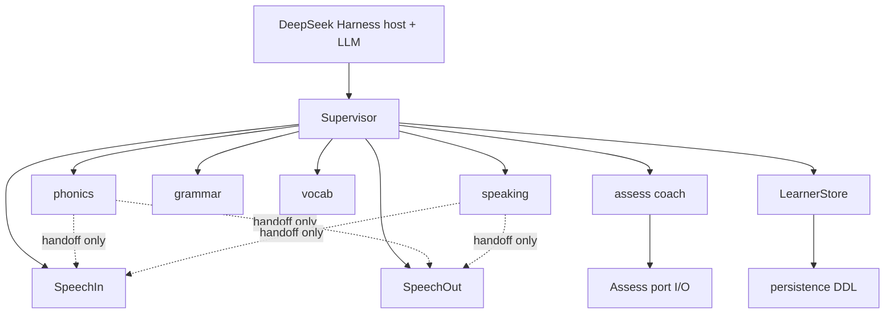
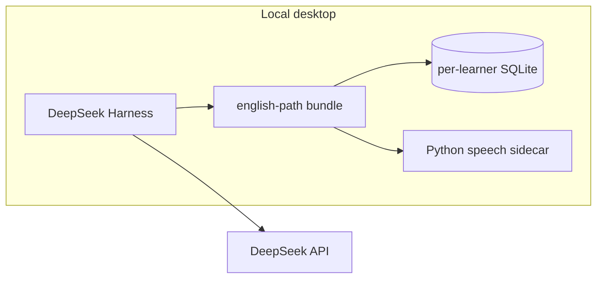
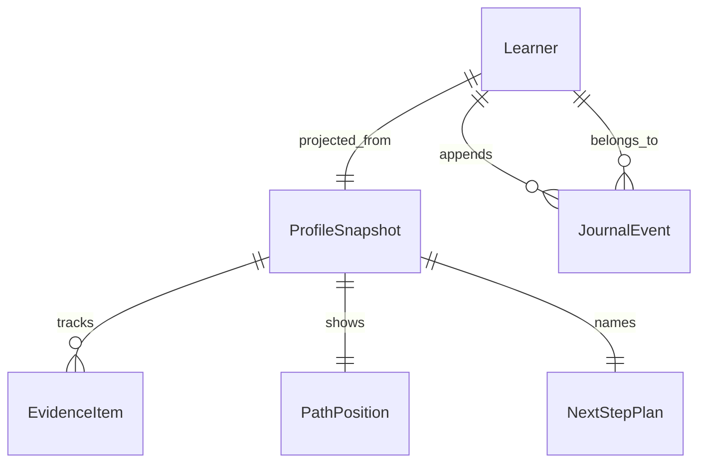

# Architecture Spine — English Path

## Design Paradigm

**Supervisor-orchestrator + specialist coaches**, with **ports at the DeepSeek Harness edge**.

| Layer        | Responsibility                                                                |
| ------------ | ----------------------------------------------------------------------------- |
| Harness host | Desktop runtime, LLM/agent loop, sparse UI shell, profile install             |
| Supervisor   | Session plan, transitions, channel grant/reclaim, journal commits             |
| Coaches      | phonics · speaking (incl. interview) · grammar · vocab(+SRS) · assess         |
| Ports        | SpeechIn · SpeechOut · LearnerStore · Assess (I/O only)                       |
| Content      | Versioned path/gates pack · generated lesson surface · iterative rubrics      |
| Persistence  | DDL/migrations for snapshot projection + journal (owned here, not by coaches) |

Writing coach is out of v1 pilot. Coaches do not negotiate the plan with each other.

## Invariants & Rules

### AD-1 — Supervisor owns plan, transitions, and evidence [ADOPTED]

- **Binds:** all session flow; FR-8, FR-12, FR-14…FR-17, FR-29
- **Prevents:** peer coaches negotiating next-step; dual writers of learner evidence
- **Rule:** Supervisor alone names the plan, drives session phase transitions, and commits durable learner mutations. Coaches return structured results only — they never write `LearnerStore` directly.

### AD-2 — One installable `english-path` bundle [ADOPTED]

- **Binds:** packaging, plugin inventory, trusted-circle install
- **Prevents:** version-skew multi-plugin coach set in v1; god-object without internal seams
- **Rule:** Ship a single Harness-installable `english-path` Cordis plugin bundle (loaded via Harness patch overlay / `dsh plugin` into a profile — not a second Harness product). Inside it, keep hard modules: `supervisor/` · `coaches/*` · `ports/*` · `content/` · `persistence/`. Defer splitting into separately versioned Harness plugins until host stability or a second product requires it.

### AD-3 — Hybrid learner channel with explicit handoff lifecycle [ADOPTED]

- **Binds:** UJ-1…UJ-5 dialogue; FR-2, FR-8, FR-11, FR-13, FR-26…FR-28, FR-31
- **Prevents:** dual mouths; genre blocks as supervisor monologue; coaches holding the channel after reclaim; Self-check turning into graded praise
- **Rule:** Supervisor is the sole mouth for plan naming, orientation, review weave, finale, and level-advance overlay. For **genre scenario blocks** (UJ-4 interviewer/debriefer; UJ-5 phonics micro-turns including Self-check playback), supervisor **grants** channel to one active coach and **reclaims** on block end, stop-anytime, fatigue deferral, or supervisor timeout — reclaim always wins; no dual mouths. During handoff, FR-33 Self-check silence/no-aloud-wrong still bind the active coach. On handback: structured result only. Evidence commits remain supervisor-only.

### AD-4 — Journal is the write path; snapshot is a projection [ADOPTED]

- **Binds:** FR-29, FR-30, UJ-2 return, finale fact comparisons, PathPosition / NextStepPlan / EvidenceItem
- **Prevents:** direct snapshot patches bypassing journal; dual mutation paths; freeform vs typed journal forks
- **Rule:** All durable mutations append a typed `JournalEvent`, then supervisor (or its projector) rebuilds the **profile snapshot** — snapshot fields are not patched independently. Closed event types (v1): `session_start` · `prefs_set` · `phase` · `handoff_grant` · `handoff_reclaim` · `attempt` · `evidence_propose` · `plan_set` · `finale` · `level_advance` · `session_end`. Payload field calibration may evolve under a `schema_version`; the type set does not fork per epic.

### AD-5 — Own ports for speech and store; Harness is host+LLM [ADOPTED]

- **Binds:** NFR §5.1, §5.6, FR-33; A0 self-check audio
- **Prevents:** cloud ASR/TTS/analytics for the pilot; coaches owning persistence DDL; treating experimental Harness voice as the FR-33 bar
- **Rule:** DeepSeek Harness provides desktop host + DeepSeek LLM/agent runtime. `SpeechIn`, `SpeechOut`, `LearnerStore` are explicit ports with swappable adapters (Harness-bundled ASR such as experimental SenseVoice may be an adapter candidate, but FR-33 accept/reject + Self-check TTS remain english-path port responsibilities). `ports/assess` is **I/O only** (model/file call). Persistence DDL/migrations live under `persistence/`, used only via `LearnerStore`. No product telemetry pipeline in v1. Self-check audio is learner-local only. Speech adapters that need native inference run behind a **required** local Python sidecar (`>=3.10,<3.13` while Kokoro 0.9.4 is pinned).

### AD-6 — Dependency direction [ADOPTED]

- **Binds:** module graph inside the bundle
- **Prevents:** coaches depending on each other; non-active coaches touching speech; store writes from coaches
- **Rule:** Coaches must not import/call each other. Only supervisor commits via `LearnerStore` (journal append). During channel handoff, the **active** coach may use `SpeechIn`/`SpeechOut`. Non-active coaches are headless: context in → structured result out. Port adapters sit at the edge.



### AD-7 — Hybrid content truth [ADOPTED]

- **Binds:** path map FR-5/FR-22; gates FR-14…FR-17; phonics FR-18…FR-21; interview FR-26; assess FR-23
- **Prevents:** model-temperature drift of path structure; over-curation blocking generated lesson surface
- **Rule:** **Versioned content pack** owns path structure (A0→C1 horizon, B1+/interview near-term milestone), level-transition criteria / critical gates, and genre template shells. **Lesson surface** (contrast pairs, picture words, mock prompts) is generated-first with human spot-check. **Rubrics** are iterative versioned files interpreted by the **assess coach** — calibrated over time, not one-shot perfect.

### AD-8 — Multiple local Learner identities [ADOPTED]

- **Binds:** trusted-circle pilot; FR-29 store shape
- **Prevents:** single-learner-only assumption; cross-learner reads; mid-session identity switching as a “mode”
- **Rule:** One `english-path` bundle supports multiple local Learner identities. Isolation = **one SQLite file (or schema namespace) per learner id** — no shared tables across learners, no cross-learner reads. Learner switch happens **before** session start (supervisor/host), never as an in-session mode/topic picker.

### AD-9 — EvidenceItem + delta merge contract [ADOPTED]

- **Binds:** all coaches’ `evidence_deltas`; snapshot EvidenceItem; vocab SRS; FR-12, FR-25
- **Prevents:** phonics vs vocab inventing incompatible durable skill rows; undefined supervisor merge
- **Rule:** Durable skill state is an `EvidenceItem`: `{ id, kind, status, updated_at, payload? }` where `status ∈ {confirmed, unstable, goes_into_review}` (transition overlay statuses are session UI, not durable skill state). `kind` is a closed v1 set: `phonics_contrast` · `letter` · `grammar` · `vocab` · `speaking` · `interview_block` · `cefr_dimension`. Coach `evidence_deltas[]` are proposals of that shape (or status-only patches keyed by `id`). Supervisor merges by `id` upsert + status lattice (`confirmed` > `unstable` > `goes_into_review` for worsening requires explicit `evidence_propose`; no silent downgrade without event). **SRS schedule** for `kind=vocab` lives in `payload` (`due_at`, `box`) on the same EvidenceItem — not a parallel store schema.

### AD-10 — Assess coach owns assessment semantics [ADOPTED]

- **Binds:** FR-14…FR-17, FR-23, FR-28 readiness rows; rubrics
- **Prevents:** dual homes for CEFR/gate/readiness logic in coach vs port
- **Rule:** `coaches/assess` owns rubric interpretation, gate evaluation inputs to supervisor, and interview readiness row semantics. `ports/assess` only performs I/O (LLM call, rubric file read). Supervisor still alone commits `level_advance` / plan via journal (AD-4).

### AD-11 — Within-level queue vs Level gates [ADOPTED]

- **Binds:** FR-16, FR-17, FR-21; UJ-3 vs UJ-5
- **Prevents:** phonics weak items hard-blocking the next within-level lesson; soft advance applied as a Level unlock game
- **Rule:** Critical hard-block applies only to **CEFR/Level transitions**. Within a level, unstable items queue into review and must not mark the next within-level lesson `not available`. Content pack names which criteria are critical; assess coach evaluates; supervisor enforces via `level_advance` events only.

## Consistency Conventions

| Concern             | Convention                                                                                                                                                                                                                                                                 |
| ------------------- | -------------------------------------------------------------------------------------------------------------------------------------------------------------------------------------------------------------------------------------------------------------------------- |
| Evidence vocabulary | Learner-facing statuses: `confirmed` · `unstable` · `goes into review` · `next`; transition overlay may add `almost confirmed` · `conditionally available` · `threshold reached` · `open`/`available` · `not available`/`not open`. Never unlock/XP/streak/badge language. |
| Tone pack           | Stop anytime always honored; no mode/topic/continue-vs-review chooser; fatigue deferral is not failure; return has no missed-days guilt (FR-2, FR-7, FR-13, FR-30).                                                                                                        |
| Coach ids           | `phonics` · `speaking` · `grammar` · `vocab` · `assess`. Tool-ish names (`phonics_grade`, `vocab_srs`, `cefr_assess`, `mistake_recorder`, …) are internal functions — not separate Harness plugins in v1.                                                                  |
| Plan object         | Supervisor-owned: `{ focus, topic?, level, unstable_summary?, available_now?, blocks[], length_min, genre?, length_override_reason? }` — covers orientation strip (FR-9) and agent-named plan (FR-8).                                                                      |
| Handoff result      | `{ evidence_deltas: EvidenceItem[], artifacts?, readiness_rows?, notes }` — supervisor journals then projects.                                                                                                                                                             |
| Ids & time          | Learner id local opaque string; EvidenceItem `id` stable within learner; timestamps ISO-8601 UTC in journal.                                                                                                                                                               |
| Errors              | Port failures soft-fail to text channel where FR-31 allows; never aloud “wrong” on STT reject (FR-33).                                                                                                                                                                     |
| Config              | A0 STT/TTS thresholds in learner-adaptive profile fields seeded from FR-33 defaults.                                                                                                                                                                                       |
| Logging             | Local journal is the audit trail; no cloud analytics.                                                                                                                                                                                                                      |

## Stack

SEED — verified 2026-10-08; adapters swappable behind ports; code owns detail once present. DeepSeek Harness is developer preview (breaking changes expected).

| Name                                  | Version                                                                          |
| ------------------------------------- | -------------------------------------------------------------------------------- |
| DeepSeek Harness (`@deepseek-ai/dsh`) | 0.2.0-rc.2 (preview; re-pin at implement)                                        |
| Cordis (`@deepseek-ai/cordis`)        | 4.0.4                                                                            |
| Plugin language                       | TypeScript (Harness Cordis plugin)                                               |
| DeepSeek LLM / API                    | via Harness model plugin + `DEEPSEEK_API_KEY`                                    |
| SpeechIn adapter                      | faster-whisper 1.2.1 (swap if FR-33 mixed EN–RU WER bar fails pilot measurement) |
| SpeechOut adapter                     | Kokoro TTS 0.9.4 (must pass FR-33 MOS/slowdown or swap voice/engine)             |
| LearnerStore adapter                  | SQLite 3 via `better-sqlite3` (pin at implement)                                 |
| Speech sidecar                        | Python `>=3.10,<3.13` (Kokoro 0.9.4 constraint)                                  |

## Structural Seed

```text
english-path/                      # one Cordis plugin bundle
  cordis.patch.yml                 # Harness overlay (absolute plugin paths per dsh docs)
  src/
    supervisor/                    # plan, phases, channel grant/reclaim, journal commit
    coaches/
      phonics/
      speaking/                    # incl. interview genre
      grammar/
      vocab/                       # + SRS payload on EvidenceItem
      assess/                      # rubric/gate/readiness semantics
    ports/
      speech-in/
      speech-out/
      learner-store/
      assess/                      # I/O only
    content/                       # versioned path/gates + rubric files
  persistence/                     # sqlite schemas, migrations, per-learner DB files
  sidecar/                         # Python speech adapters
```



**Operational envelope (v1):** local/desktop Harness only (desktop app or `dsh web`); install `english-path` into a Harness profile via patch/`dsh plugin`; multi-learner switch pre-session; no SaaS accounts, sync-at-scale, or cloud analytics. Model calls may need network; learner progress and self-check audio stay local.



## Capability → Architecture Map

| Capability / Area                                | Lives in                                  | Governed by                   |
| ------------------------------------------------ | ----------------------------------------- | ----------------------------- |
| FR-1…FR-6 first launch                           | supervisor + phonics                      | AD-1, AD-3, AD-7              |
| FR-7…FR-13 return / review / finale              | supervisor                                | AD-1, AD-3, AD-4, tone pack   |
| FR-14…FR-17 level advance                        | supervisor + assess coach + content gates | AD-1, AD-7, AD-10, AD-11      |
| FR-18…FR-21 phonics / L1                         | phonics coach + content surface           | AD-3, AD-6, AD-7, AD-11       |
| FR-22…FR-25 path / assess / anti-game / mistakes | supervisor + assess + vocab               | AD-1, AD-7, AD-9, conventions |
| FR-26…FR-28 interview                            | speaking coach (handoff)                  | AD-3, AD-6, AD-10             |
| FR-29…FR-30 persistence / resume                 | LearnerStore + supervisor                 | AD-4, AD-8, AD-9              |
| FR-31…FR-33 channels / voice bar                 | Speech ports + supervisor/active coach    | AD-3, AD-5, conventions       |

## Deferred

| Item                                                                    | Why it can wait                                                                 |
| ----------------------------------------------------------------------- | ------------------------------------------------------------------------------- |
| Exact critical Level-gate matrices & interview “enough runs” thresholds | PRD §8.1 assessment calibration — principle locked (AD-11), lists not           |
| Millisecond audio latency budgets                                       | PRD: calibrate after Self-check instrumentation                                 |
| Journal/EvidenceItem _field_ calibration beyond closed types            | Types locked (AD-4, AD-9); fields may version under `schema_version`            |
| True multi-plugin Harness split                                         | AD-2; revisit when dsh plugin API stabilizes or a second product shares coaches |
| Writing coach                                                           | PRD out of first pilot                                                          |
| Phoneme aligner beyond Whisper token probs (wav2vec2/MFA)               | Spike if FR-33 phoneme checks need it; port stays SpeechIn                      |
| SenseVoice (or other Harness ASR) as SpeechIn adapter                   | Candidate only; FR-33 measurement decides                                       |
| Cloud sync / multi-device / accounts                                    | Post-v1; conflicts with NFR privacy pilot                                       |
| Gamification / `motivation_engine`                                      | Product non-goal                                                                |
| C1 content as ship target                                               | Path horizon only in v1                                                         |
